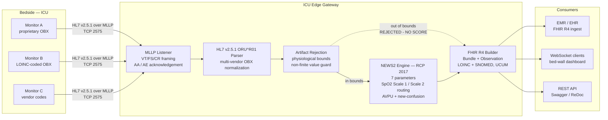
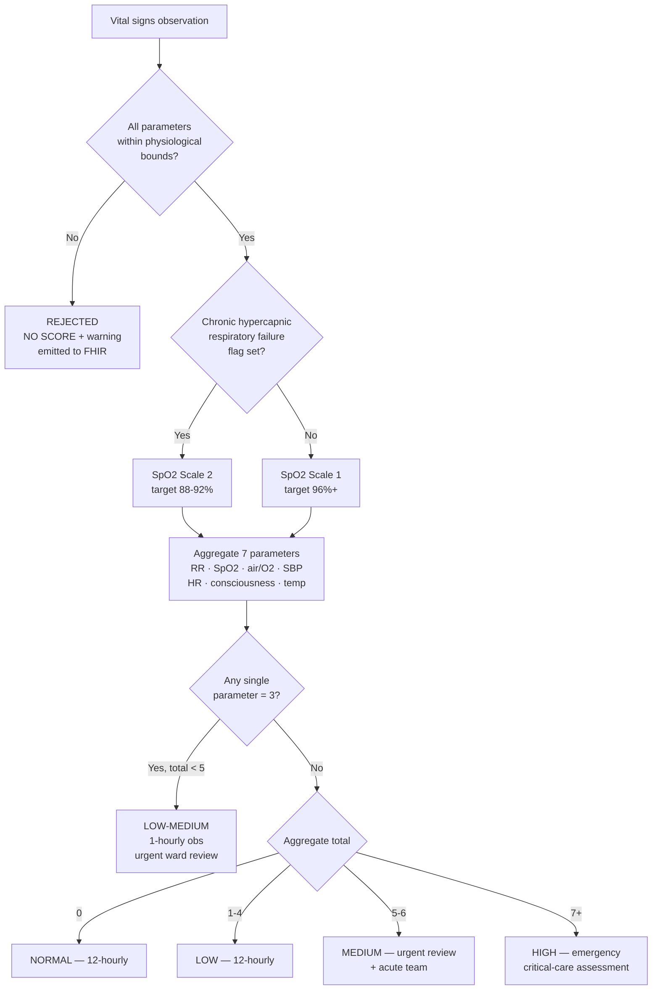
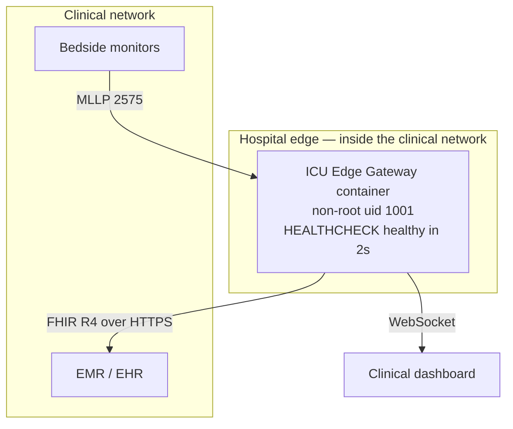

# Architecture & Clinical UX Specification

**Owner:** Eng. Housam Ashraf — Biomedical Engineer & HealthTech Solutions Architect
**Audience:** buyer-side CTO, Chief Architect, Head of Interoperability, clinical product lead
**Status of contents:** every value below is read from the implemented code, not aspirational.

---

## 1. System data flow

**The branch that matters commercially** is the dotted one. An out-of-bounds reading does not produce
a score of zero and does not silently vanish — it is marked `REJECTED` and emitted with **no score**
plus a warning. Fabricating a reassuring zero from a disconnected lead is the failure mode that
creates alarm fatigue in the opposite direction: false reassurance. Point at this line in a pitch.

---

## 2. Clinical decision path — NEWS2 routing

**The LOW-MEDIUM branch is the differentiator.** A patient with a single parameter scoring 3 and an
aggregate total below 5 escalates to hourly observation under RCP 2017, even though the total looks
reassuring. Collapsing that case into LOW hides exactly the patient the rule exists to catch. The
implementation treats it as a distinct band with its own visual treatment. Most naive NEWS2
implementations get this wrong; it is a concrete, checkable claim you can invite a buyer to verify.

---

## 3. Deployment topology

**Deployment posture, stated accurately:** the container runs as a non-root user (uid/gid 1001) and
reports healthy within 2 seconds, both CI-verified. The demo layer is excluded from the image by
design. **The image currently measures 372 MB against the project's own 150 MB edge budget** — an open
gap tracked as GAP-DOCKER-SIZE-001. Do not describe the container as edge-optimized until that closes.
Disclose it if a buyer asks about footprint; they will respect the answer more than the omission.

---

## 4. Bed-wall UI specification

### 4.1 Layout hierarchy

Three levels, in strict order of visual weight:

1. **Bed card grid** — the primary surface. One card per bed. Dark canvas (`#0e1117`), cards
   `#161b22` with a `#30363d` border, 8 px radius.
2. **Per-card hierarchy**, largest to smallest:
   - NEWS2 aggregate score — `3.4rem`, weight 800. The single largest element on screen.
   - Risk band chip — colour-filled, carries the band label.
   - Escalation text — the RCP response instruction. This is the half a nursing director actually
     buys; it is what converts a number into an action.
   - Per-parameter score bars — seven rows, each a labelled bar with its own score colour.
   - Bed metadata — `0.75rem`, `#8b949e`. Deliberately quiet.
3. **Sidebar** — gateway health, API links, observed throughput. Diagnostic, never competing with the
   bed cards for attention.

### 4.2 Risk band colour system

| Band | Background | Foreground | Marker | Escalation |
|---|---|---|---|---|
| NORMAL | `#1b5e20` | `#ffffff` | ● | Routine — minimum 12-hourly observations |
| LOW | `#558b2f` | `#ffffff` | ●● | Low — minimum 12-hourly observations |
| LOW-MEDIUM | `#f9a825` | `#1a1a1a` | ▲ | Single parameter scored 3 — 1-hourly obs, urgent ward review |
| MEDIUM | `#ef6c00` | `#ffffff` | ▲▲ | Urgent review by ward clinician + escalation to acute team |
| HIGH | `#b71c1c` | `#ffffff` | ■■■ | Emergency assessment by critical-care team — continuous monitoring |
| NO SCORE | `#37474f` | `#eceff1` | — | No NEWS2 score in this message — see warnings |

Per-parameter score colours: `#b71c1c` (score 3+), `#ef6c00` (2), `#558b2f` (1), `#30363d` (0).

### 4.3 Accessibility — the design decision worth presenting

Colour is **never the sole carrier of clinical meaning.** Every band carries three redundant signals:

- the colour,
- a distinct **shape marker** (● / ●● / ▲ / ▲▲ / ■■■) that survives monochrome printing and every
  form of colour-vision deficiency,
- a **greyscale weight** (0–5) so severity ordering is preserved when rendered without colour.

This is a defensible clinical-safety design choice, not decoration. Roughly 1 in 12 men has a
colour-vision deficiency; a red/green-only severity scale is a patient-safety defect in a clinical
display. Say this out loud in a pitch — buyer-side clinical leads notice it.

### 4.4 Measured contrast — and one honest gap

WCAG 2.1 contrast ratios, computed against the specified foregrounds:

| Band | Ratio | Grade |
|---|---|---|
| NORMAL | 7.87 | AAA |
| LOW-MEDIUM | 8.83 | AAA |
| NO SCORE | 8.35 | AAA |
| HIGH | 6.57 | AA |
| **LOW** | **4.10** | **AA-large only** |
| **MEDIUM** | **3.08** | **AA-large only** |

**Two bands fall short of WCAG AA (4.5:1) for normal-size text.** They pass AA-large (3:1), which is
defensible for the large chip text they are currently used in — but a buyer's accessibility review
will flag it, and you should reach that conversation having already fixed it rather than defending it.

**Proposed remediation** — same hue family, no redesign, AA-compliant:

| Band | Current | Proposed | New ratio |
|---|---|---|---|
| LOW | `#558b2f` | `#456f26` | 5.91 (AA) |
| MEDIUM | `#ef6c00` | `#c85400` | 4.45 → use `#bf360c` for 5.60 (AA) |

This is a two-line change in `RISK_STYLES` in `demo/dashboard_logic.py`. It touches the demo layer
only — not `src/`, not the validated clinical algorithms, and not any test. Recommended before the
Loom recording.

### 4.5 Latency and refresh

| Property | Value | Source |
|---|---|---|
| Dashboard refresh interval | 2.0 s (`REFRESH_SECONDS`) | Implemented |
| Streamer send interval | 2.0 s default | Implemented |
| Container health-check ready | ~2 s | CI-verified |
| Transport to dashboard | WebSocket, `/api/v1/live/vitals` | Implemented |

The refresh interval is deliberately matched to the send interval. Rerunning faster than data arrives
preempts the render and produces visible tearing without adding information — the pacing is a design
decision, and the code says so in a comment. That comment is the kind of detail a buyer-side architect
reads as a signal about the rest of the codebase.

**Not measured, do not claim:** end-to-end ingest-to-display latency under load, sustained throughput
ceiling, and behaviour at realistic ICU bed counts. No load test has been run. If a buyer asks for a
latency number, the correct answer is "not measured yet — here is the test I would run."

---

## 5. What a buyer's architect will ask, and the honest answer

| Question | Answer |
|---|---|
| Does it handle multi-vendor HL7 without per-vendor config? | Yes — three concurrent vendor formats observed normalizing live. |
| What happens to a malformed message? | NAK'd (AE) without dropping the connection. Tested. |
| What is your test coverage? | 816 passing / 1 xfailed, 94.6% statements, CI-confirmed. |
| Are the tests meaningful or padding? | 42 non-finite-value tests; 18 fail against pre-fix code. Load-bearing. |
| Is it FDA cleared? | No. Designed against the non-device CDS criteria in FD&C Act §520(o)(1)(E); advisory output only; not reviewed by FDA or any notified body. |
| Has it seen real patient data? | No. Synthetic only. |
| Is it deployed anywhere? | No. |
| Security hardening? | Not done — no TLS, authn/z, or CORS lock-down. Scoped as buyer-side work. |
| Container footprint? | 372 MB against a 150 MB internal target. Open gap, multi-stage rebuild needed. |

Rehearse this table. The deal is won by answering the bottom half without flinching.
